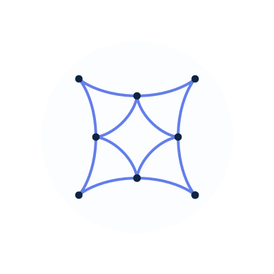

    

        
        <h1 align="center">Gerolamo</h1>
    

  
Cardano typescript client implementation

    
    
  

# Gerolamo

## How to run
• You will need latest version of Bun JS Run time from https://bun.sh 
• Clone the repo: `git clone https://github.com/@harmoniclabs/gerolamo` 
• install deps: `bun i` 
• Start node with config: `bun src/index.ts --config ./src/config/config.json` (same as subcommand `start-node`) 
• View help: `bun src/index.ts --help` 
• Use subcommands: `bun src/index.ts start-node --config ./src/config/config.json` (same as above, starts and syncs the node based on config) 
• Other commands: `bun src/index.ts download-ledger-state <path>, etc.` 

## Roadmap

### Q1 (Before end of March)

- [x] [ouroboros mini-protocols](https://github.com/HarmonicLabs/ouroboros-miniprotocols-ts)
      necessary for chain syncronization
  - [x] [chain-sync](https://github.com/HarmonicLabs/ouroboros-miniprotocols-ts/tree/main/src/protocols/chain-sync)
  - [x] [block-fetch](https://github.com/HarmonicLabs/ouroboros-miniprotocols-ts/tree/main/src/protocols/block-fetch)
- [ ] ledger data
  - [x] headers
  - [ ] blocks
- [ ] ledger state
  - [x] `lmdb` scheme (this will be `indexedDb` in the browser)
  - [ ] worker (same as chain selection)
  - [ ] read-only interface
  - [ ] read-write interface
- [ ] header validation logic
  - [x] [vrf](https://github.com/HarmonicLabs/crypto/blob/main/src/vrf.ts)
  - [ ] ledger state integration
- [ ] consensus (Praos)
  - [ ] chain selection
  - [ ] volatile DB
  - [ ] rollback handling

### Q2 (Before end of June)

- [ ] peer worker (currently on main thread)
- [ ] mithril bootstrap
- [ ] network comunications
  - [ ] browser-to-fullnode
  - [ ] browser-to-browser via WebRTC
- [ ] mempool
  - [x] [shared mempool](https://github.com/HarmonicLabs/shared-cardano-mempool-ts)
  - [ ] tx validation (depends on ledger state)
  - [x] [tx-submission](https://github.com/HarmonicLabs/ouroboros-miniprotocols-ts/tree/main/src/protocols/tx-submission)
        mini protocol
- [ ] node-to-client
  - [x] [miniprotocols](https://github.com/HarmonicLabs/ouroboros-miniprotocols-ts)
  - [ ] local socket
  - [ ] CIP integration for browsers
- [ ] immutable DB (not for browsers)

## Contribution Guidelines

For more details on how to contribute, please refer to the
[CONTRIBUTING.md](CONTRIBUTING.md) file.

## Communication

Join our community discussions on [Discord](https://discord.gg/Zh8bBynQ4W) and
stay updated on our progress through our
[GitHub Issues](https://github.com/HarmonicLabs/gerolamo/issues) and
[Twitter](https://twitter.com/hlabs_tech).

## License

This project is licensed under the terms of the [LICENSE](LICENSE) file.

## Why?

1. Educational purposes, opening core development to a wider spectrum of
   developers.

2. serve as a base for nodes running in browsers

3. Extensibility, be the base for purpose specific nodes, that don't require all
   the work that a full node does, some examples could be:

   - light weight node following only the tip of the chain (example usages: some
     mini-protocols servers or ad-hoc chain indexer saving blocks elsewhere)
   - node that only keeps the ledger state, for optimal UTxO queries
   - etc.
