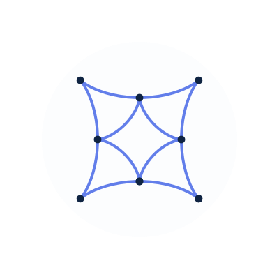

    

        
        <h1 align="center">Gerolamo</h1>
    

  
Cardano typescript client implementation

  

    
    
  

# Gerolamo

### Cardano Node implementation in Typesript

## Why?

1) Open core development to a wider spectrum of developers, with a considerable impact on the decentralization of Cardano

2) serve as a base to then extract the "runtime indipendent" code and have a passive node running in browsers

3) be the example project for future, purpose specific nodes, that don't require all the work that a full node does, some examples could be:

    - light weight node following only the tip of the chain (example usages: some mini-protocols servers or ad-hoc chain indexer saving blocks elsewhere)
    - node that only keeps the ledger state, for optimal UTxO queries
    - etc.